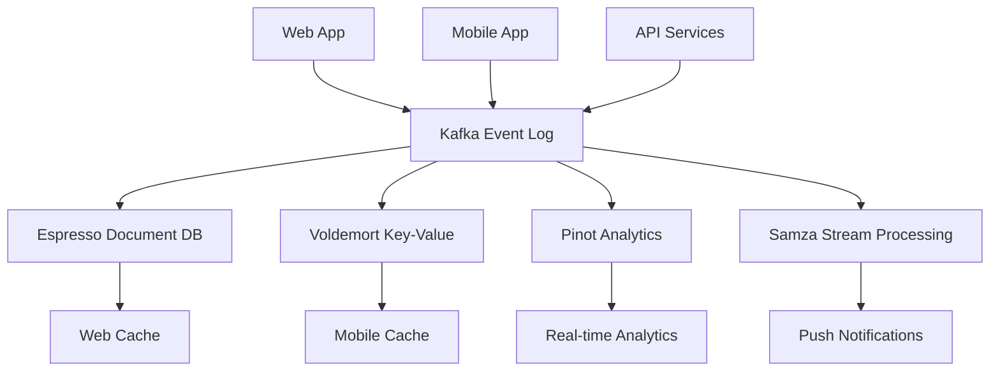
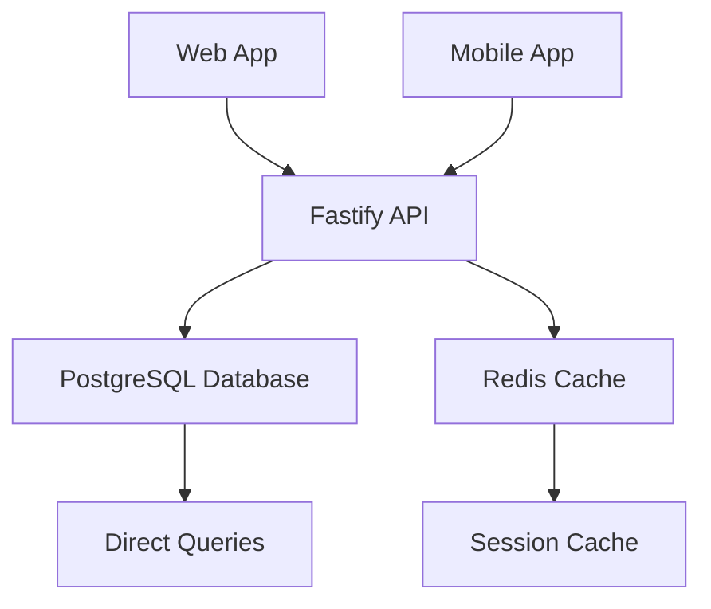

# 🔍 LinkedIn Architecture vs Hyred Strategy

## 🎯 Executive Summary

**Short Answer**: No, our current Hyred strategy is **simpler** than LinkedIn's architecture, but that's **intentionally appropriate** for our scale. LinkedIn uses a sophisticated **multi-database, event-driven architecture** that would be overkill for Hyred's current needs.

## 🏗️ Architecture Comparison

### LinkedIn's Approach (Enterprise Scale)


### Hyred's Proposed Approach (Startup Scale)


---

## 📊 Detailed Comparison

| Aspect | LinkedIn (350M+ users) | Hyred (Startup) | Recommendation |
|--------|------------------------|------------------|----------------|
| **Database Strategy** | Multiple specialized DBs | Single PostgreSQL | ✅ **Hyred approach is correct** |
| **Data Synchronization** | Kafka event log (500B+ events/day) | Direct API calls | ✅ **Start simple, scale later** |
| **Mobile Offline** | Complex sync with conflict resolution | Basic offline queue | ✅ **Appropriate complexity** |
| **Real-time Updates** | Multi-channel (WebSocket + Push + Kafka) | WebSocket + Basic push | ✅ **Sufficient for now** |
| **Consistency Model** | Eventual consistency by design | Strong consistency | ✅ **Better UX for small scale** |

---

## 🔍 LinkedIn's Sophisticated Architecture

### 1. **Multi-Database Strategy**
LinkedIn doesn't use "one database to rule them all":

```yaml
linkedin_databases:
  espresso:
    purpose: "Primary document storage"
    scale: "Billions of documents"
    consistency: "Eventual"
    
  voldemort:
    purpose: "High-speed key-value access"
    scale: "Trillions of requests/day"
    consistency: "Eventually consistent"
    
  kafka:
    purpose: "Event streaming and log"
    scale: "Trillions of events/day"
    consistency: "Ordered log"
    
  pinot:
    purpose: "Real-time analytics"
    scale: "Billions of events/hour"
    consistency: "Approximate"
```

### 2. **Event-Driven Architecture**
All data changes flow through Kafka as the central "source of truth":

```typescript
// LinkedIn's event log pattern
interface LinkedInEvent {
  timestamp: string;
  userId: string;
  eventType: 'profile_update' | 'connection_added' | 'message_sent';
  data: any;
  previousData?: any;
}

// Everything is an event
const profileUpdateEvent: LinkedInEvent = {
  timestamp: '2024-01-15T10:30:00Z',
  userId: 'user123',
  eventType: 'profile_update',
  data: { headline: 'Senior Software Engineer' },
  previousData: { headline: 'Software Engineer' }
};
```

### 3. **Sophisticated Mobile Sync**
LinkedIn's mobile apps have complex offline capabilities:

```typescript
// LinkedIn's mobile sync strategy
class LinkedInMobileSync {
  async syncProfileUpdates() {
    const localChanges = await this.getLocalChanges();
    const serverChanges = await this.getServerChanges();
    
    // Three-way merge (local, server, common ancestor)
    const merged = this.threeWayMerge(localChanges, serverChanges);
    
    // Conflict resolution based on timestamps and business rules
    const resolved = this.resolveConflicts(merged);
    
    // Apply changes locally and queue for server
    await this.applyChangesLocally(resolved);
    await this.queueForServerSync(resolved);
  }
  
  // Sophisticated conflict resolution
  resolveConflicts(changes: any) {
    // Business logic for different conflict types
    if (changes.type === 'profile_field_conflict') {
      return this.resolveProfileConflict(changes);
    } else if (changes.type === 'connection_conflict') {
      return this.resolveConnectionConflict(changes);
    }
    // ... many more conflict types
  }
}
```

### 4. **Real-time Multi-Channel Delivery**
```yaml
linkedin_realtime:
  channels:
    - websocket: "Active web sessions"
    - push_notifications: "Mobile apps (iOS/Android)"
    - email: "Digest summaries"
    - sms: "Critical alerts only"
    
  delivery_strategy:
    - critical_events: "All channels immediately"
    - social_events: "Push + digest, no SMS"
    - analytics_events: "WebSocket only"
```

---

## 🚀 Hyred's Current Strategy Analysis

### What's Right About Our Approach:

1. **Single PostgreSQL Database** ✅
   ```sql
   -- Our approach: One database, multiple clients
   SELECT * FROM users WHERE id = 'user123'; -- Same for web AND mobile
   ```

2. **Direct API Calls** ✅
   ```typescript
   // Our approach: Simple, reliable
   const userData = await api.get('/api/users/123');
   ```

3. **Strong Consistency** ✅
   ```typescript
   // Our approach: Immediate consistency
   await updateUserProfile(userId, newData);
   const updated = await getUserProfile(userId); // Guaranteed fresh
   ```

4. **Progressive Enhancement** ✅
   ```typescript
   // Start simple, add complexity as needed
   if (platform === 'mobile') {
     await addOfflineSupport();
     await addPushNotifications();
   }
   ```

### What We Should Add (LinkedIn-Inspired):

1. **Event Logging** (Simplified)
   ```typescript
   // Add event tracking for future scaling
   await logEvent({
     type: 'profile_updated',
     userId: user.uid,
     timestamp: new Date(),
     platform: 'mobile'
   });
   ```

2. **Offline-First Mobile** (Basic)
   ```typescript
   // Simple offline queue (not LinkedIn's complex merge)
   if (!isOnline) {
     await queueOperation('UPDATE_PROFILE', data);
   }
   ```

3. **Platform Analytics** (Essential)
   ```typescript
   // Track platform usage
   await trackEvent('user_login', {
     platform: 'mobile',
     deviceType: 'ios',
     appVersion: '1.0.0'
   });
   ```

---

## 📈 Scaling Roadmap: Hyred → LinkedIn Level

### Phase 1: Current (Startup) ✅
```yaml
hyred_phase_1:
  database: "PostgreSQL single instance"
  api: "Fastify REST API"
  mobile: "React Native with basic offline"
  sync: "Simple queue + retry"
  users: "1K-100K"
  complexity: "Low"
```

### Phase 2: Growth (10K-1M users)
```yaml
hyred_phase_2:
  database: "PostgreSQL read replicas"
  api: "GraphQL + REST hybrid"
  mobile: "Advanced offline sync"
  sync: "Event log + conflict resolution"
  cache: "Redis cluster"
  complexity: "Medium"
```

### Phase 3: Scale (1M+ users) 🚀
```yaml
hyred_phase_3:
  database: "PostgreSQL sharding + specialized stores"
  events: "Kafka or similar event streaming"
  mobile: "LinkedIn-level offline architecture"
  sync: "Multi-way merge + business rules"
  analytics: "Real-time processing"
  complexity: "High"
```

---

## 🎯 **Key Insights**

### 1. **LinkedIn's Architecture is Overkill for Hyred Now**
- LinkedIn handles 350M+ users and trillions of events
- Hyred needs to handle thousands, not millions
- Their complexity would slow down development unnecessarily

### 2. **Our Strategy is Architecturally Sound**
- Single database is correct for our scale
- Direct API calls are reliable and simple
- Strong consistency provides better UX at small scale
- We can evolve toward LinkedIn's approach as we grow

### 3. **LinkedIn's Principles Are Valuable**
- Event-driven thinking (we should log events)
- Offline-first mobile (essential for good UX)
- Platform-specific optimization (smart)
- Gradual consistency (eventual consistency by design)

---

## 🚀 **Recommended Evolution Path**

### Keep Current Strategy, Add These LinkedIn-Inspired Enhancements:

1. **Event Logging Foundation**
   ```typescript
   // Add to all major operations
   await logEvent({
     type: 'JOB_APPLIED',
     userId: user.uid,
     jobId: job.id,
     platform: 'mobile',
     timestamp: new Date()
   });
   ```

2. **Robust Mobile Offline**
   ```typescript
   // Enhanced offline with conflict detection
   class HyredOfflineSync {
     async syncChanges() {
       const conflicts = await this.detectConflicts();
       if (conflicts.length > 0) {
         return this.resolveConflicts(conflicts);
       }
       return this.applyChanges();
     }
   }
   ```

3. **Platform Analytics**
   ```typescript
   // Track platform-specific metrics
   analytics.track({
     event: 'profile_view',
     properties: {
       platform: 'mobile',
       deviceType: 'ios',
      connectionType: 'wifi' // mobile-specific
     }
   });
   ```

4. **Real-time Foundation**
   ```typescript
   // Simple WebSocket for real-time updates
   const socket = new WebSocket('wss://api.hyred.com/realtime');
   socket.on('job_update', (data) => {
     updateMobileUI(data);
   });
   ```

---

## 📊 **When to Evolve Toward LinkedIn's Architecture**

### Triggers for Architecture Upgrade:

1. **Scale Triggers**
   - 100K+ active users
   - 1M+ daily API calls
   - 10K+ concurrent connections

2. **Performance Triggers**
   - API response time > 500ms p95
   - Database query time > 100ms p95
   - Mobile sync conflicts > 5% of operations

3. **Business Triggers**
   - Multiple product lines
   - Complex business rules
   - Regulatory requirements
   - Global deployment needs

### Migration Strategy:
```typescript
// Gradual migration approach
class ArchitectureEvolution {
  async migrateToEventDriven() {
    // Phase 1: Add event logging to existing operations
    await this.addEventLogging();
    
    // Phase 2: Build event processing pipeline
    await this.buildEventPipeline();
    
    // Phase 3: Gradually move to event sourcing
    await this.migrateToEventSourcing();
    
    // Phase 4: Add specialized databases
    await this.addSpecializedDatabases();
  }
}
```

---

## ✅ **Final Recommendation**

**Stick with our current unified database strategy**, but:

1. **Add event logging** for future flexibility
2. **Implement robust mobile offline** with basic conflict resolution
3. **Build in platform analytics** from day one
4. **Design APIs to be event-friendly** for future evolution
5. **Plan for database sharding** when you hit scale milestones

**LinkedIn's architecture is the destination, not the starting point.** Our current approach will serve Hyred well through significant growth, and we can evolve toward LinkedIn's sophistication when (and if) we need that level of complexity.

The key insight: **Start simple, evolve intelligently, scale gracefully.** 🚀